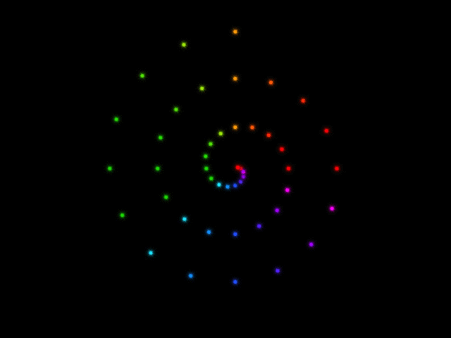

# Organizing an Archimedes' Screw with OpenGL

## Usage
On Mac, we can directly run this program by `./a` under this directory.

To compile and run, use 
~~~
g++ -std=c++11 -stdlib=libc++ -lglfw3 -framework CoreVideo -framework OpenGL -framework IOKit -framework Cocoa -framework GLUT -o a ../libSOIL.a main.cpp ../glad.c
~~~

Notice, here we utilized a library [SOIL](http://www.lonesock.net/soil.html). The proper way to compile/install this library is discussed in [this issue](https://github.com/ArayCHN/Computer-Aided-Design/issues/6).

## Functionalities
This project takes in the picture `Star.bmp` as input, and creates a animation where stars are "spawned" in the fashion of an Archimedes' spiral, in different colors.

Things to notice:

* Input picture is black backgrounded. Need to convert the black background to transparency. This is called *BLENDING*. The proper way to blending here is ~~~
glEnable(GL_BLEND);
glBlendFunc(GL_SRC_COLOR, GL_ONE_MINUS_SRC_COLOR);
~~~ So that when source color is black `(0.0, 0.0, 0.0)`, the blending result is the destination color.
* Stars vanish at the edge of a circle. Delete the elements in a vector when they go beyond the circle.
* Stars' colors are different from the original white. Use a multiplication is fragment shader to combine color with texture. Since texture color is white `(1.0, 1.0, 1.0)`, the final result will adopt the chosen color instead of white.

## Tips

1. DO NOT USE `glEnable(GL_DEPTH_TEST);`. In this project all stars' `z` values are 0. Therefore, when depth is detected, the new image will never overwrite the original image, even if blending is set.

2. The center of the image is `(0.0, 0.0)`.