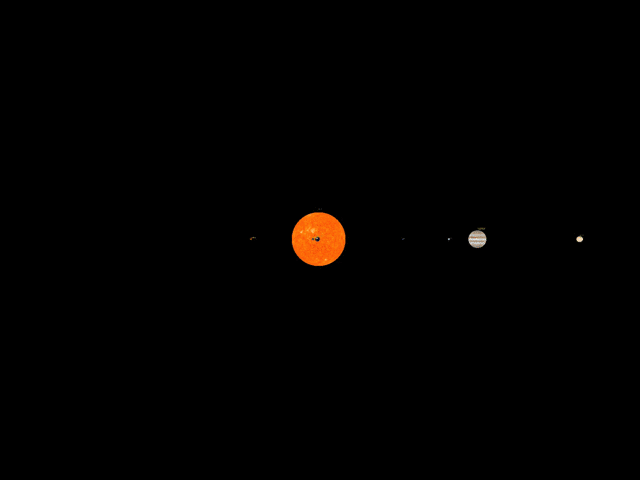

# Navigating the Solar System

(The gif is not showing text clearly due to optimization requirements for web browser downloading.)

In this project, we draw a mini Solar System in 3D space with flat pictures of these celestial bodies given.

* Each planet is rotating around the sun, the moon rotates around the earth.
* The name of each body follows it (text).
* We are able to navigate within this 3D space with keyboard and mouse pad.

## Usage

* under this directory, use `./a` for Mac users, or ``` g++ -I ../freetype -L/usr/local/lib -std=c++11 -stdlib=libc++ -lglfw3 -framework CoreVideo -framework OpenGL -framework IOKit -framework Cocoa -framework GLUT -o a ../libSOIL.a /usr/local/lib/libfreetype.dylib main.cpp ../glad.c``` to compile then `./a`.
* use keyboard UP, DOWN, LEFT, RIGHT to move the camera.
* use keyboard W, S, A, D to rotate camera.
* use keyboard M, N to move closer/farther.
* use mouse scroll to zoom in/out.

Enjoy!

## Installation of Freetype Library
We use [freetype](https://www.freetype.org/) to render fonts.

On Mac, use `brew install freetype` to install. (`homebrew` has to be installed before you install freetype, of course.)

To link the program with this library, manually inlcude the `.dylib` file when invoking g++. Use the `-I ../freetype` flag, `-L/usr/local/lib`, `libfreetype.dylib` options to find the library. Under directory `../freetype`, files have to be organized like what I did in my repo.

## Tricky Problems

### tricky problem with `glm::perspective`:

`glm::perspective(FoV angle in radians, aspect ratio, near plane, far plane)` usage explained:
Here, near plane and far plane are the __relative__ depth value from the camera. `near plane` has to be greater than 0, otherwise openGL depth check will fail. Also, `far plane` value cannot be too large, otherwise nothing will be displayed. See [this thread](https://stackoverflow.com/questions/41935764/opengl-depth-test-is-not-working) for details.

### tricky problem with `textShader.Use()`:

There is another problem with the library which cost me a lot of time to debug. When I am using two different shaders for text and image rendering separately, the command `glUniformMatrix4fv(glGetUniformLocation(textShader.Program, "view");, 1, GL_FALSE, glm::value_ptr(view));` only passes the value `view` into the vertexShader after the command `textShader.Use()` is invoked. Otherwise, the `view` matrix in the vertex shader of `textShader` will not be properly assigned! This is unreasonable given that `glGetUniformLocation(textShader.Program, "view")` has already specified which shader we want to pass the view matrix to.