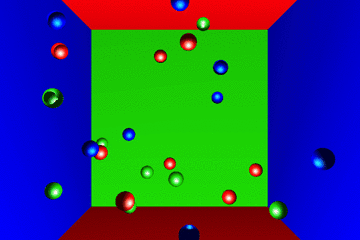
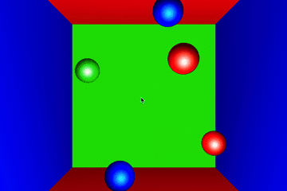
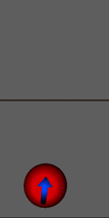

## Simple Physics Engine

**Author Rui Wang**

**Department of Mechanical Engineering, Tsinghua University**

### Notice
This project is the homework assignment of a CMU course __Computer Aided Design__. You can find the instructions of this project from the files additionalMaterial.pdf and README. Note that quite some libraries have to be installed properly on your computer before you can run `make`. The makefile is only composed for Mac, and need to be changed a bit for Linux or Windows systems.

### Usage
On my mac, with [libpng](http://www.libpng.org/pub/png/libpng.html)(ONLY version 12!) installed under lib/lib (already contained in the folder), first run `source compile.sh`.

After that, as long as you keep the terminal open, you should only need to run `make` to compile new changes and run `./physics scenes/The_scene_you_want_to_load`.

### Features
* Collisions: sphere & sphere, sphere & plane
* Damping: collision damping
* Rotation: apply torque to cause sphere rotation
* Spring: a virtual spring hanging the sphere like a pendulumn, with damping
* Newton's Cradle: a spring hanging system that transports the energy from one end to the other

### Implementation Details
There are some points worth noticing in doing this project, most of them being physics-related details:

* There is a "graohical" object that actually displays the motion on your screen. Beyond updating the physics bodies, we need to update the positions and orientations of those graphical bodies.
* Most planes in this project are constructed by triangles, so do not be confused with `planes` in this project - most of them are useless. We need to implement the collision between spheres and triangles to see the effect of "balls reflecting from the walls".
* When calculating torque, the `offset` of the force resulting from a spring need to be rotated along with the sphere. Meaning, the spring is attached to a fixed point on the sphere.
* The spring is not attached to the sphere directly, it has an offset. Be careful when calculating the length of the spring.
* `apply_force()` adds new force and torque to the body, instead of resetting the force. This is because, when we apply more than one force to the body, we do not have an equivalent force and offset. We have equivalent force and torque, but that is not what the original function proviede by the project is asking for. Therefore, in cases like a spring system, every update step, we need to first apply the negative force of the previous step (to delete the previous force) and then apply the new force.
* Read the pdf file carefully. All notices in the pdf file are important, as they are common pitfalls. Failure to notice the points made in the file will result in weird behavior of the engine.

### Problems

I did not use "real" RK-4. I did implement Runge-Kutta, but because I do not have the x member in the differential function (the 1-st derivative of position is only a function of time), the expression of my RK4 is essentially just a constant-acceleration locomotion with a very small dt.

Also, I could not implement RK4 inside `physics.cpp` due to the fact that I need to update the velocity of an object but I could not access the velocity member of type `Body` from the springs (as `Body` class does not have `force` member, therefore I could not calculate the acceleration from `physics.cpp`, I could only calculate it directly inside `sphereBody.cpp`).